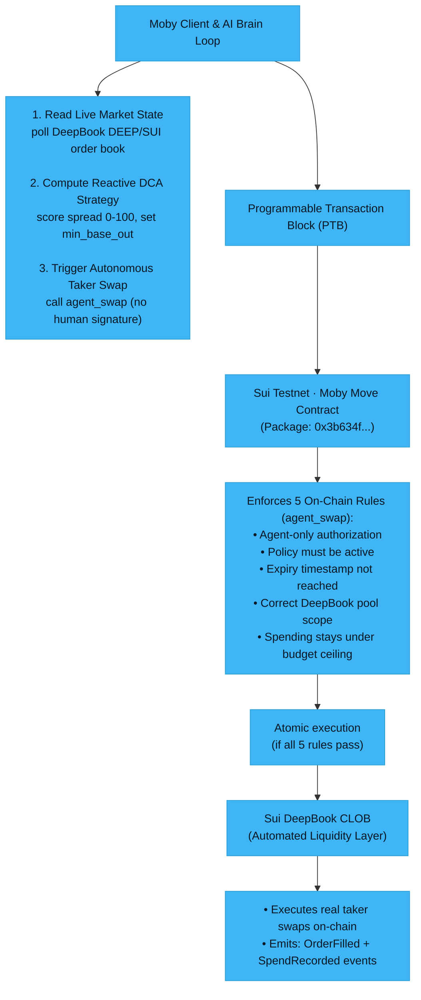

# 🐋 Moby — Autonomous Agent Wallet

> **An on-chain autonomous agent wallet built on Sui.** Moby lets you escrow a capped budget to an autonomous agent that trades on **real DeepBook**, enforced by a Move policy — agent identity, spend ceiling, pool scope, expiry, and an instant kill-switch, all on-chain. The agent runs a transparent **rule-based Reactive DCA** strategy (no LLM, no black box) inside that **Move-enforced sandbox**.

[](https://suiexplorer.com)
[](https://docs.sui.io/guides/developer/first-app)
[](https://react.dev)
[](https://vitejs.dev)

---

## ✨ How It Works

1. **Deploy a Policy** — Connect your wallet, pick an agent address, and call `create_policy` to **escrow a SUI budget** into a shared `AgentPolicy` object (with an expiry and an allowed DeepBook pool).
2. **Agent Trades** — The delegated agent calls `agent_swap`, which executes a **real DeepBook taker swap** (SUI → DEEP) — the only way funds leave the vault. Move asserts agent identity, active status, not-expired, correct pool, and spend ≤ ceiling, all in one transaction.
3. **Kill-Switch** — At any time the owner can call `revoke_policy`; the next `agent_swap` aborts with `EPolicyRevoked`.
4. **Top Up** — The owner can escrow more SUI and raise the ceiling via `top_up_allowance`.

---

## 🏗 Architecture



<details>
<summary>ASCII version (kalau Mermaid nggak ke-render)</summary>

```
┌─────────────────────────┐        ┌────────────────────────────────────────┐
│  Moby Client &           │ ─────▶ │ 1. Read Live Market State                │
│  AI Brain Loop           │        │    poll DeepBook DEEP/SUI order book      │
└───────────┬─────────────┘        │ 2. Compute Reactive DCA Strategy          │
            │                       │    score spread 0-100, set min_base_out   │
            │                       │ 3. Trigger Autonomous Taker Swap          │
            ▼                       │    call agent_swap (no human signature)   │
┌─────────────────────────┐        └────────────────────────────────────────┘
│ Programmable Transaction │
│ Block (PTB)              │
└───────────┬─────────────┘
            │
            ▼
┌─────────────────────────┐        ┌────────────────────────────────────────┐
│ Sui Testnet ·            │ ─────▶ │ Enforces 5 On-Chain Rules (agent_swap):  │
│ Moby Move Contract       │        │  - Agent-only authorization               │
│ (Package: 0x3b634f...)   │        │  - Policy must be active                  │
└─────────────────────────┘        │  - Expiry timestamp not reached           │
                                    │  - Correct DeepBook pool scope            │
                                    │  - Spending stays under budget ceiling    │
                                    └─────────────────┬──────────────────────┘
                                                      │
                                                      ▼
┌─────────────────────────┐        ┌────────────────────────────────────────┐
│ Sui DeepBook CLOB        │ ◀───── │ Atomic execution                         │
│ (Automated Liquidity)    │        │ (if all 5 rules pass)                    │
└───────────┬─────────────┘        └────────────────────────────────────────┘
            │
            ▼
┌──────────────────────────────────────┐
│ - Executes real taker swaps on-chain  │
│ - Emits: OrderFilled + SpendRecorded  │
└──────────────────────────────────────┘
```

</details>

---

## 📁 Repository Structure

```
Moby/
├── packages/
│   └── move/                   # On-chain Move smart contract
│       ├── Move.toml
│       ├── Move.lock
│       ├── Published.toml      # Deployed contract metadata
│       └── sources/
│           └── moby_policy.move
├── dashboard/                  # React + Vite front-end dApp
│   ├── src/
│   │   ├── components/         # UI components (17 total)
│   │   ├── pages/              # Landing, Dashboard, Docs
│   │   ├── hooks/              # useAutonomousAgent, useMobyAgent, usePolicyState
│   │   ├── providers/          # SuiProviders, PolicyProvider
│   │   ├── lib/                # Config, types, constants, router
│   │   └── styles/             # CSS tokens, animations, app styles
│   ├── index.html
│   ├── package.json
│   ├── vite.config.ts
│   └── .env.example
├── moby_eating.png             # Brand assets
├── moby_sleep.png
└── moby_swimming.png
```

---

## 🚀 Quick Start

### 1. Clone & Install

```bash
git clone https://github.com/zkzora/Moby-Autonomous-Agent-Wallet.git
cd Moby-Autonomous-Agent-Wallet
cd dashboard
npm install
```

### 2. Configure Environment

```bash
cp .env.example .env.local
# Edit .env.local and set VITE_MOBY_PACKAGE_ID to the deployed package address
```

### 3. Run the Dashboard

```bash
npm run dev
# Open http://localhost:5173
```

---

## 📦 Move Smart Contract

The `moby_policy` Move package is deployed on **Sui Testnet**.

| Property | Value |
|---|---|
| Network | Sui Testnet |
| Package ID (type / original) | `0x3b634fb9f0f3ed3f6753dbddb743cf40304b0e11eee0b1346161af9f4304a508` |
| Latest version (call target) | `0xc59772890bbe7f58c19f20281804f8e0bf15d300aa9f191eb7449bceb4a2544e` |
| DeepBook (active, called) | `0x22be4cade64bf2d02412c7e8d0e8beea2f78828b948118d46735315409371a3c` |
| Pool | `Pool<DEEP, SUI>` · `0x48c95963…e9bae9f` |
| Chain ID | `4c78adac` |

> **Publishing note:** `agent_swap` calls DeepBook, whose public repo lags the
> live testnet deploy. Run `packages/move/scripts/fix-deepbook-published-at.sh`
> before `sui client publish` — details in [packages/move/README.md](packages/move/README.md).

### Build & Test Locally

```bash
cd packages/move
sui move build
sui move test
```

### Contract API

| Function | Caller | Effect |
|---|---|---|
| `create_policy(agent, allowed_pool, duration_ms, funds, clock)` | anyone (becomes owner) | Escrows `funds` (SUI) as the budget, sets pool + expiry, shares the `AgentPolicy` |
| `top_up_allowance(policy, funds)` | owner | Escrows more SUI and raises the ceiling |
| `revoke_policy(policy)` | owner | Flips `is_active` to false (kill-switch) |
| `withdraw_unspent(policy, amount)` | owner | Reclaim `amount` of unspent escrowed SUI back to the owner (re-pegs the ceiling) |
| `close_policy(policy)` | owner | Drain the whole vault back to the owner + revoke, in one call |
| `agent_swap<Base>(policy, pool, amount, min_base_out, clock)` | agent | **The only fund-exit door** — real DeepBook swap (SUI → `Base`), asserts all five guards, emits `SpendRecorded` |

**Errors:** `ENotOwner (0)`, `ENotAgent (1)`, `EPolicyRevoked (2)`, `EBudgetExceeded (3)`, `EZeroAmount (4)`, `EPolicyExpired (5)`, `EPoolNotAllowed (6)`, `ESlippage (7)`

---

## 🤖 Strategy — Reactive DCA (live)

Moby runs **one** transparent, rule-based strategy — no black box, no overclaim:

- **Reactive DCA (DEEP/SUI)** — Each tick the agent reads the **live DeepBook order book**, scores the bid-ask spread **0–100**, and accumulates a fixed SUI tranche **only when the spread is tight enough** (≤ threshold), skipping otherwise. Every decision prints a plain-text rationale to the activity feed, e.g. *"spread 0.82% ≤ 1.0% → accumulating 0.25 SUI (score 59)"*.

The scorer reads real on-chain market data (DeepBook indexer + `min_base_out` derived from the live best ask), and every execution funnels through the single chokepoint — `agent_swap` — where Move enforces `amount_spent + amount <= allowance_limit`, the pool scope, and the expiry. The ceiling cannot be breached. See the [Strategy Architecture docs](dashboard/src/pages/Docs.tsx) and [`strategy.ts`](dashboard/src/lib/strategy.ts) for the rule.

> This is **real DeepBook execution in a Move-enforced policy sandbox** on testnet — not a production trading engine. The strategy is deliberately simple and the agent key is client-side (see Security Model).

---

## 🛠 Tech Stack

| Layer | Technology |
|---|---|
| Blockchain | [Sui Network](https://sui.io) |
| Smart Contract | [Move 2024](https://docs.sui.io) |
| Frontend | [React 18](https://react.dev) + [TypeScript](https://www.typescriptlang.org) |
| Build Tool | [Vite 5](https://vitejs.dev) |
| Wallet Integration | [@mysten/dapp-kit](https://sdk.mystenlabs.com/dapp-kit) |
| State / Queries | [@tanstack/react-query](https://tanstack.com/query) |

---

## 🔐 Security Model

- **Escrowed, not custodial** — funds live in the policy's `vault` and can leave only through `agent_swap`, which buys `Base` and routes it (plus any unspent SUI) back to the **owner**. The agent never receives funds.
- **Five guards, enforced in Move** — agent identity, kill-switch, expiry, pool allow-scope, and the spend ceiling are all asserted on-chain in a single `agent_swap` tx; no off-chain logic can bypass them.
- **Instant kill-switch** — `revoke_policy` severs the agent permanently; the next swap aborts.
- **Agent key disclosure (testnet)** — to enable popup-free autonomous execution, the dApp holds a throwaway agent keypair **client-side** (bundled by Vite). It is funded with gas only and is bounded by the on-chain policy. **This is a testnet-only convenience.** For mainnet the right design is a **session key** or **sponsored transactions** — never a key in the browser bundle.
- Private keys and `.env.local` are **never committed** to this repository.

---

## 🧭 Future Work

Moby today is a **sandbox**: one honest, working strategy (Reactive DCA) executing real DeepBook swaps inside a Move-enforced policy. The natural next steps:

- **More strategy profiles** — the same `agent_swap` chokepoint and scorer interface can host momentum, mean-reversion, or cross-book arbitrage logic. Each is just a different rule feeding `min_base_out` + a decision; the on-chain guards are unchanged.
- **Mainnet-grade agent auth** — replace the testnet client-side agent key with **session keys** or **sponsored transactions** (zkLogin / Enoki), so no key is ever bundled in the browser.
- **Multi-pool / multi-asset** — generalize the vault beyond `Balance<SUI>` and allow a set of permitted pools rather than a single `allowed_pool`.
- **Smarter sizing & dust** — a variable last tranche (down to the pool minimum) and optional auto-reclaim of sub-minimum dust.
- **Reproducible DeepBook dependency** — vendor the `deepbook` package (or pin a tagged release) once the active testnet version is committed upstream, dropping the build-time published-at patch script.
- **Indexer-independent pricing** — fall back to an on-chain `get_quantity_out` dev-inspect when the DeepBook indexer is unavailable.

---

## 📄 License

MIT — see [LICENSE](LICENSE) for details.

---

<p align="center">Built with 🐋 by <a href="https://github.com/zkzora">zkzora</a></p>
